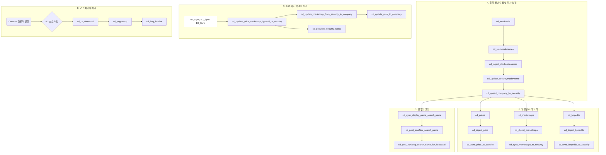

# CD (Chundan) 프로젝트 기술 문서

## 1. 개요

**CD(Chundan) 프로젝트**는 대한민국 주식 시장(KOSPI, KOSDAQ, KONEX)의 데이터를 수집, 처리, 분석하여 종합적인 금융 정보를 제공하는 데이터 파이프라인 프로젝트입니다. Dagster를 기반으로 자산(Asset) 단위로 파이프라인이 구성되어 있으며, 데이터 수집부터 최종 지표 생성까지의 전 과정을 자동화합니다.

이 문서는 CD 프로젝트의 아키텍처, 데이터 흐름, 주요 자산(Asset)의 역할과 관계, 핵심 로직, 데이터베이스 스키마 등을 상세히 기술하여 프로젝트에 대한 깊이 있는 이해를 돕는 것을 목표로 합니다.

## 2. 아키텍처 및 핵심 개념

### 2.1. 기술 스택

-   **데이터 파이프라인**: Dagster
-   **데이터 처리**: Pandas
-   **데이터 수집**: `pykrx` (Python), `Crawlee`/`Playwright` (TypeScript/Node.js)
-   **메인 데이터베이스**: PostgreSQL, TursoDB (libSQL)
-   **임시/캐시 데이터베이스**: DuckDB (과거 데이터 스테이징 및 이미지 파이프라인 로그)
-   **이미지 저장소**: Cloudflare R2
-   **실행 환경**: Local, Docker (크롤러 실행용)

### 2.2. 듀얼 데이터베이스 지원

CD 프로젝트는 PostgreSQL과 TursoDB 두 가지 데이터베이스를 모두 지원합니다. 대부분의 파이프라인은 `_turso.py` 접미사가 붙은 별도의 자산 파일로 복제되어 있으며, 각 데이터베이스 환경에 맞는 SQL 문법(예: `?` vs `%s` 파라미터)과 드라이버를 사용하도록 구현되어 있습니다.

### 2.3. 파티션: `daily_exchange_category_partition`

대부분의 자산은 `daily_exchange_category_partition` 파티션을 사용합니다. 이는 `(날짜, 거래소)`의 두 가지 차원으로 작업을 분리하여 실행할 수 있게 해주는 Dagster 파티션 정의입니다.

-   **`date`**: 데이터 처리 기준일 (예: `2025-09-19`)
-   **`exchange`**: 거래소 구분 (`KOSPI`, `KOSDAQ`, `KONEX`)

이를 통해 특정 날짜, 특정 거래소의 데이터만 독립적으로 재처리하거나 백필(backfill)하는 것이 용이합니다.

### 2.4. 주요 환경 변수 설정

`.env` 파일을 통해 파이프라인의 동작을 제어합니다. 주요 변수는 다음과 같습니다.

-   `CD_DATABASE_URL`: PostgreSQL 접속 정보.
-   `TURSO_DATABASE_URL` / `TURSO_AUTH_TOKEN`: TursoDB 접속 정보.
-   `CD_R2_ACCESS_KEY_ID` / `CD_R2_SECRET_ACCESS_KEY`: Cloudflare R2 접속 키.
-   `CD_R2_ENDPOINT`: R2 API 엔드포인트.
-   `CD_R2_SOURCE_BUCKET` / `CD_R2_TARGET_BUCKET`: 이미지 소스/타겟 버킷 이름.
-   `CD_PUBLIC_URL`: 최종 이미지의 공개 URL 기본 경로.

## 3. 데이터 파이프라인 의존성 다이어그램



## 4. 파이프라인 상세 설명

### A. 종목 정보 수집 및 회사 설정 (`cd_raw_ingestion.py`)

-   **`cd_ingest_stockcodenames`**: 신규/폐지/변경을 식별하기 위해 `stockcodename`과 `security` 테이블을 `outer join`하여 `_merge` 컬럼을 기준으로 대상을 필터링합니다.
-   **`cd_update_securitytypebyname`**: 종목 타입을 분류합니다.
    -   **핵심 로직**: `_parse_security_type` 함수 내의 정규식을 사용하여 종목명에서 특정 패턴을 찾아냅니다.
    ```python
    PATTERNS_SECURITY_TYPE = {
        "스팩": re.compile(r"스팩(\d+호)?$"),
        "리츠": re.compile(r"리츠$"),
        "펀드": re.compile(r"(맥쿼리인프라|맵스리얼티1|유전)$"),
        "전환우선주": re.compile(r"\(전환\)$"),
        "우선주": re.compile(r"[0-9]*우[A-Za-z]*$"),
    }
    ```
-   **`cd_upsert_company_by_security`**: `security`를 `company`에 연결합니다.
    -   **핵심 로직**: `_get_company_name` 함수는 `_parse_company_name`을 호출하여 종목명에서 "(전환)", "우B" 같은 접미사를 제거하고 순수한 회사명을 추출합니다. 이 이름으로 `company` 테이블을 조회하거나 새로 생성하며, 새 레코드에는 `country='대한민국'`, `type='상장법인'`, `created_at`/`updated_at=CURRENT_TIMESTAMP`를 기본값으로 채워 넣습니다. 이후 `security.company_id`를 일괄 업데이트하면서 잠금 충돌을 줄이기 위해 정렬된 배치로 커밋합니다.

### B. 일별/과거 데이터 처리

-   **`cd_prices` / `cd_marketcaps` / `cd_bppedds`**: `pykrx` API에서 일별 가격·시총·재무지표 데이터를 받아 각각 `tmp_prices`, `tmp_marketcaps`, `tmp_bppedds` 임시 테이블에 적재합니다. 모든 값은 파티션별로 기존 레코드를 삭제한 뒤 삽입하며, 티커를 6자리 문자열로 통일합니다. `cd_bppedds`는 KONEX 시장일 때는 빈 DataFrame을 반환해 downstream에서 자동으로 건너뜁니다.
-   **`cd_digest_price` / `cd_digest_marketcaps` / `cd_digest_bppedds`**: 임시 테이블에서 본 테이블로 데이터를 이동하기 전 `(df[cols] == 0).all(axis=1)` 패턴으로 휴장일 데이터를 제거하고, 정합성이 맞지 않으면 오류를 발생시켜 tmp 데이터를 정리합니다. 검증을 통과한 데이터는 ISO 날짜·연·월 파생 컬럼을 추가해 정렬한 뒤 적재하며, `cd_digest_price`는 CSV 버퍼와 `COPY ... FROM STDIN`을 활용하고 나머지 자산은 `execute_batch`로 일괄 INSERT합니다. 완료 후 해당 파티션의 tmp 데이터를 삭제합니다.
-   **`cd_sync_price_to_security` / `cd_sync_marketcaps_to_security` / `cd_sync_bppedds_to_security`**: `security` 테이블을 기준으로 정규화된 `security_id`, `name`, `kor_name`을 매핑합니다. 잠금 순서를 일정하게 유지하기 위해 티커/거래소 기준으로 정렬한 배치를 `execute_batch`로 업데이트합니다.

### C. 통합 지표 및 순위 산정 (`cd_metrics_processing.py`)

-   **`cd_update_price_marketcap_bppedd_to_security`**: 여러 테이블에 분산된 최신 지표를 `security` 테이블 하나로 모으는 핵심 자산입니다.
    -   **핵심 로직**: `EXCHANGES = ["KOSPI", "KOSDAQ", "KONEX"]` 범위의 증권을 대상으로 PostgreSQL `LATERAL JOIN`을 사용해 `price`, `marketcap`, `bppedd` 테이블에서 가장 최근 레코드를 찾고, `shares`, `marketcap`, `bps/per/pbr/eps/div/dps`와 각 기준일 컬럼을 한 번의 `UPDATE` 문으로 갱신합니다. `shares_date`와 `marketcap_date`는 시총 테이블의 최신 날짜를 재사용합니다.
-   **`cd_update_marketcap_from_security_to_company`**: 최신 `marketcap_date`를 찾은 뒤 동일 회사에 속한 증권 시총을 합산하여 `company.marketcap`과 `marketcap_date`를 업데이트합니다. `WITH company_marketcap` CTE와 `ORDER BY company_id` 정렬을 통해 데드락을 예방합니다.
-   **`cd_update_rank_to_company`**: `ROW_NUMBER() OVER (ORDER BY marketcap DESC)`로 새 순위를 계산하고, 기존 순위와 다를 때에만 `marketcap_rank`를 갱신하면서 `marketcap_prior_rank`에 이전 값을 보존합니다.
-   **`cd_populate_security_ranks`**: `METRICS_TO_PROCESS` 리스트에 정의된 `marketcap`, `bps`, `per`, `pbr`, `eps`, `div`, `dps` 지표를 순회하며 `security_rank` 테이블에 업서트합니다. 각 지표의 기준일이 동일한 경우에 한해 순위를 계산하고, 직전 순위(`prior_rank`)를 함께 기록하여 추적성을 확보합니다.

### D. 검색어 생성 (`cd_display_processing.py`)

-   **`cd_sync_display_name_search_name`**: `security`와 연계된 `company`의 `kor_name`이 `display_name`/`search_name`에 존재하지 않으면 새 레코드를 생성합니다. `스팩`, `리츠`, `펀드` 타입은 제외하고, 중복을 방지하기 위해 기존 순서를 기준으로 `order` 값을 계산합니다.
-   **`cd_post_eng2kor_search_name`**: `_eng2kor` 함수를 통해 영문자를 한글 발음으로 치환합니다. (예: `"HDC"` -> `"에이치디씨"`)
-   **`cd_post_kor2eng_search_name_for_keyboard`**: `Inko` 클래스를 사용하여 한글을 영문 키보드 맵핑으로 변환합니다. (예: `"삼성"` -> `"tkator"`)

### E. 로고 이미지 처리

-   **크롤러 (`cd-naver-crawler/src/routes.ts`)**: Playwright를 사용하여 네이버 검색 결과 페이지에서 회사 로고 이미지의 CSS Selector를 찾아 스크린샷을 찍습니다.
    -   **핵심 로직**: 특정 CSS Selector를 사용하여 로고 `` 태그를 찾습니다.
    ```typescript
    const selector = '#main_pack > section.sc_new.cs_common_simple._company_info_simple > div.cm_content_wrap > div > div > div.detail_info > a > img';
    const imgLocator = page.locator(selector);
    ```
-   **`cd_r2_download`**: `CD_R2_SOURCE_BUCKET`의 PNG 파일을 모두 다운로드해 `data/images/cd/{bucket}` 폴더로 모은 뒤 메타데이터를 남깁니다.
-   **`cd_png2webp`**: 로컬 PNG를 WebP로 변환하고, 후속 단계에서 함께 업로드될 수 있도록 변환 결과를 기록합니다.
-   **`cd_img_finalize`**: PNG/WebP 파일을 최종 디렉터리로 이동시킨 뒤 `CD_R2_TARGET_BUCKET`으로 업로드하고, `company.logo` 필드를 `CD_PUBLIC_URL` 기반 PNG URL로 갱신합니다. 처리 결과는 DuckDB의 `cd_logo_updates` 테이블에 적재되어 추적이 가능합니다.
-   **`cd_r2_clear`**: 필요 시 `CD_R2_SOURCE_BUCKET`의 PNG/WebP 객체를 모두 삭제하는 유틸리티 자산으로, 크론 전에 버킷을 비울 때 사용합니다.

## 5. 주요 데이터베이스 스키마

#### `company` - 회사 정보

| Column | Type | Description |
| :--- | :--- | :--- |
| `company_id` | `uuid` | **PK**, 회사 고유 ID |
| `name` | `varchar` | 회사명 (정제된 이름, 예: 삼성전자) |
| `kor_name` | `varchar` | 한글 회사명 |
| `marketcap` | `numeric` | 전체 시가총액 (소속된 모든 증권의 합) |
| `marketcap_date` | `date` | 시가총액 기준일 |
| `marketcap_rank` | `integer` | 시가총액 순위 |
| `logo` | `varchar` | 회사 로고 이미지 URL |

#### `security` - 증권(종목) 정보

| Column | Type | Description |
| :--- | :--- | :--- |
| `security_id` | `uuid` | **PK**, 증권 고유 ID |
| `company_id` | `uuid` | **FK**, `company.company_id` |
| `ticker` | `varchar` | 종목 티커 (예: 005930) |
| `name` | `varchar` | 증권명 (예: 삼성전자, 삼성전자우) |
| `exchange` | `varchar` | 거래소 (KOSPI, KOSDAQ, KONEX) |
| `type` | `varchar` | 증권 타입 (보통주, 우선주, 스팩 등) |
| `listing_date` | `date` | 상장일 |
| `delisting_date` | `date` | 상장폐지일 |
| `price` | `numeric` | 현재(최신) 주가 |
| `price_date` | `date` | 주가 기준일 |
| `marketcap` | `numeric` | 개별 증권의 시가총액 |
| `per`, `pbr`, `eps`... | `numeric` | 최신 재무 지표 |

#### `price` / `marketcap` / `bppedd` - 시계열 데이터 테이블

세 테이블은 유사한 구조를 가집니다.

| Column | Type | Description |
| :--- | :--- | :--- |
| `id` | `bigint` | **PK** |
| `security_id` | `uuid` | **FK**, `security.security_id` |
| `date` | `timestamp` | 데이터 기준일 |
| `exchange` | `varchar` | 거래소 |
| `ticker` | `varchar` | 종목 티커 |
| `open`, `high`, `low`, `close`... | `numeric` | 각 테이블의 해당 지표 값 |
| `year`, `month` | `integer` | 파티셔닝 및 빠른 조회를 위한 컬럼 |
