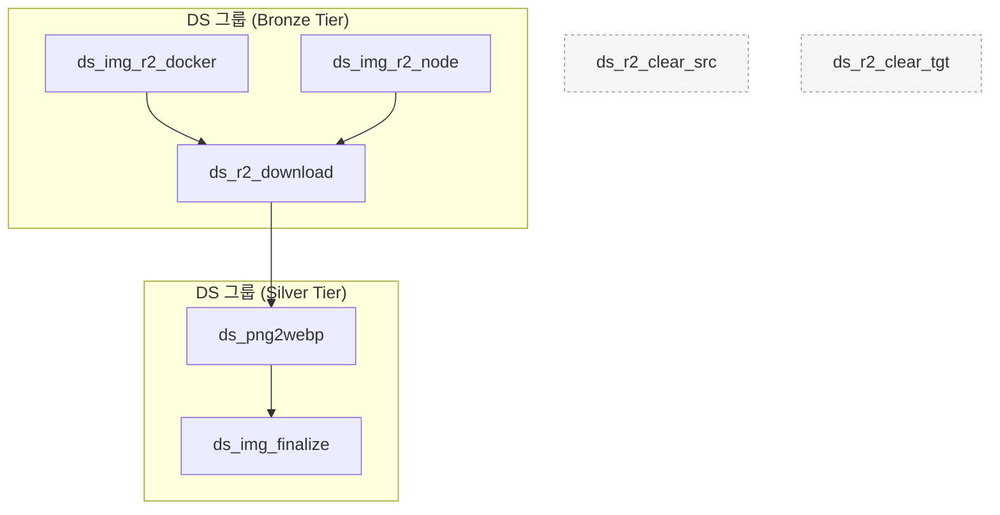

# DS (Downstream) 프로젝트

## 개요

DS (Downstream) 프로젝트는 네이버 쇼핑 라이브 플랫폼에서 라이브 커머스 데이터를 크롤링하고, 수집된 브랜드 로고 이미지를 후처리하여 Cloudflare R2 및 사내 데이터베이스에 반영하는 데 초점을 둔 데이터 파이프라인입니다. Crawlee 기반 `ds-naver-crawler`가 PNG 이미지를 Cloudflare R2 **소스 버킷**에 적재하면, Dagster 파이프라인이 해당 이미지를 내려받아 WebP로 변환하고 Cloudflare R2 **타겟 버킷**과 사내 PostgreSQL/DuckDB 스토리지에 반영합니다.

이 파이프라인은 초기 크롤링 단계를 실행하기 위한 두 가지 대안적인 방법(Node.js 직접 실행 또는 Docker 컨테이너 실행)을 제공하며, 이후 이미지를 다운로드·변환·업데이트하는 일련의 에셋으로 구성됩니다.

## 오케스트레이션 및 스케줄링

### 작업 (Jobs)

DS 파이프라인은 크롤러 실행 방식에 따라 다음 두 작업으로 시동됩니다. 두 작업 모두 지정된 소스 에셋과 그 다운스트림 에셋 전체(`ds_r2_download → ds_png2webp → ds_img_finalize`)를 실행하도록 구성되어 있습니다.

-   **`ds_node_job`**: 로컬 Node.js 환경에서 `ds-naver-crawler`를 실행하는 `ds_img_r2_node` 에셋을 기동합니다. 실시간 로그를 Dagster에 스트리밍하며, 성공 시 이미지 다운로드 및 변환 단계가 이어집니다.
-   **`ds_docker_job`**: `ds_img_r2_docker` 에셋을 통해 `ds-naver-crawler:dev` Docker 이미지를 실행합니다. 컨테이너 로그에서 로고 파일 저장 이벤트와 크롤링 통계를 추적하며, 후속 에셋이 동일한 파이프라인으로 연결됩니다.

### 리소스 (Resources)

파이프라인은 다음 리소스 및 환경에 의존합니다.

-   **PostgreSQL(`ds_postgres`)**: `ds_img_finalize` 에셋이 `company.thumbnail` 컬럼을 Cloudflare R2 공개 PNG URL로 갱신합니다.
-   **DuckDB(`ds_duckdb`)**: `ds_img_finalize` 에셋이 처리 이력을 `ds_logo_updates` 테이블에 기록합니다.
-   **Cloudflare R2 자격 증명**: 환경 변수 `DS_R2_ACCESS_KEY_ID`, `DS_R2_SECRET_ACCESS_KEY`, `DS_R2_ENDPOINT`, `DS_R2_SOURCE_BUCKET`, `DS_R2_TARGET_BUCKET`이 `boto3` 클라이언트를 구성합니다.
-   **공개 URL 설정**: `DS_PUBLIC_URL`은 최종 PNG를 외부에 노출할 기본 경로입니다.
-   **Node.js/Crawlee 환경**: `ds_img_r2_node` 실행을 위해 `dag/ds_crawlee/ds-naver-crawler` 프로젝트 의존성이 설치되어야 합니다.
-   **Docker 런타임**: `ds_img_r2_docker` 에셋은 로컬 Docker 엔진 접근 권한이 필요합니다.

## 데이터 흐름 및 에셋 종속성

이 프로젝트는 두 가지 크롤링 시작점에서 출발하여 다운로드·변환·최종 반영 단계로 이어지는 Bronze-to-Silver 파이프라인으로 구성됩니다.



`ds_r2_clear_src`/`ds_r2_clear_tgt`는 독립 실행형 유틸리티 에셋으로, 버킷 내 PNG·WebP 파일을 일괄 삭제하므로 주의가 필요합니다. `ds_r2_src_check`, `ds_r2_tgt_check` 에셋 체크는 Cloudflare R2 연결성을 사전에 확인합니다.

### 에셋 세부 정보

#### 1. `ds_img_r2_docker` / `ds_img_r2_node`
-   **티어**: Bronze
-   **그룹**: DS
-   **업스트림 종속성**: 없음
-   **설명**: Crawlee 기반 `ds-naver-crawler`를 각각 Docker/Node.js 방식으로 실행하며, 실시간 로그에서 저장된 PNG 파일명과 크롤링 통계를 추적합니다.
    -   `ds_img_r2_docker`: `ds-naver-crawler:dev` 이미지를 컨테이너로 실행하고 ANSI 코드가 제거된 로그를 Dagster에 남깁니다.
    -   `ds_img_r2_node`: `npx tsx src/main.ts`를 실행하여 Node.js 스크립트 로그를 스트리밍합니다.
-   **출력**: 처리된 PNG 파일 목록과 크롤링 통계(총 요청, 성공, 실패)를 Dagster 메타데이터에 기록합니다.

#### 2. `ds_r2_download`
-   **티어**: Bronze
-   **그룹**: DS
-   **업스트림 종속성**: `ds_img_r2_docker`, `ds_img_r2_node`
-   **설명**: Cloudflare R2 소스 버킷에서 PNG 파일을 모두 내려받아 로컬 `data/images/ds/<source-bucket>` 디렉토리에 저장하며, 다운로드 진행률과 예상 남은 시간을 로그로 제공합니다.
-   **출력**: 다운로드된 PNG 개수, 전체 버킷 내 PNG 총량, 처리 소요 시간, 로컬 저장 경로 등을 메타데이터로 남깁니다.

#### 3. `ds_png2webp`
-   **티어**: Silver
-   **그룹**: DS
-   **업스트림 종속성**: `ds_r2_download`
-   **설명**: 내려받은 PNG 파일을 80% 품질의 WebP로 변환하여 `data/images/ds/<target-bucket>` 디렉토리에 저장합니다.
-   **출력**: 변환된 WebP 파일 수, 미리보기 파일 목록 등을 Dagster 메타데이터로 제공합니다.

#### 4. `ds_img_finalize`
-   **티어**: Silver
-   **그룹**: DS
-   **업스트림 종속성**: `ds_png2webp`
-   **설명**: PNG·WebP 파일을 `data/images/ds/final`로 이동한 후 Cloudflare R2 타겟 버킷에 업로드합니다. `company` 테이블의 `thumbnail` 컬럼을 PNG 공개 URL로 갱신하고 DuckDB(`ds_logo_updates`)에 처리 이력을 적재합니다.
-   **리소스**: `ds_postgres`, `ds_duckdb`
-   **출력**: 업데이트된 회사 수, 실패한 항목, 처리된 파일 개수, 미리보기 리스트 등을 메타데이터로 제공합니다.

#### 5. 유틸리티 및 체크 에셋
-   **`ds_r2_clear_src` / `ds_r2_clear_tgt`**: 각각 Cloudflare R2 소스/타겟 버킷의 PNG·WebP 파일을 전부 삭제하는 청소 에셋입니다. 되돌릴 수 없으므로 실행 시 주의합니다.
-   **`ds_r2_src_check` / `ds_r2_tgt_check`**: R2 버킷 접근성을 HEAD 요청으로 검증하는 Asset Check입니다.

## 개발 및 디버깅

### 🔧 유용한 확인 명령어

**DS 그룹의 에셋 나열:**

```bash
cd /Users/craigchoi/silla/dag

python -c "
from dag.definitions import defs
from dagster import AssetSelection

asset_graph = defs.get_asset_graph()
ds_assets = AssetSelection.groups('DS').resolve(asset_graph)
print('🎯 Assets in the \'DS\' group:')
for asset_key in ds_assets:
    print(f'  - {asset_key.to_user_string()}')
print(f'\n📊 Total {len(ds_assets)} assets.')
"
```

**에셋 종속성 확인:**

```bash
python -c "
from dag.definitions import defs
from dagster import AssetKey

asset_graph = defs.get_asset_graph()
ds_assets = [
    'ds_img_r2_docker',
    'ds_img_r2_node',
    'ds_r2_download',
    'ds_png2webp',
    'ds_img_finalize',
]

for asset_name in ds_assets:
    asset_key = AssetKey([asset_name])
    if asset_key in asset_graph.all_asset_keys:
        deps = asset_graph.get_upstream_asset_keys(asset_key)
        print(f"{asset_name} depends on: {[dep.to_user_string() for dep in deps]}")
"
```

## 스토리지

-   **중간 스토리지**: `ds_r2_download`/`ds_png2webp` 단계에서 Cloudflare R2 소스 버킷의 PNG를 `data/images/ds/<bucket>` 경로에 임시 보관하고, 변환된 WebP는 타겟 버킷명을 사용한 하위 폴더에 저장합니다.
-   **최종 스토리지**: `ds_img_finalize` 단계에서 PNG·WebP를 `data/images/ds/final`로 이동한 뒤 Cloudflare R2 타겟 버킷에 업로드합니다. PNG 공개 URL은 PostgreSQL `company.thumbnail`에 반영되고, 처리 이력은 DuckDB `data/ds.duckdb`의 `ds_logo_updates` 테이블에 남습니다.

```
