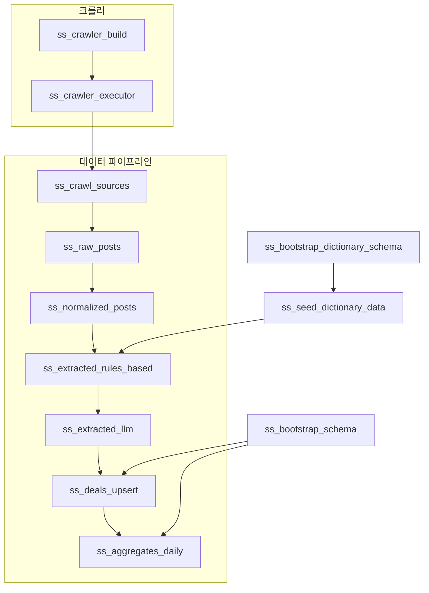

# SS (소셜 스크래핑) 프로젝트

## 개요

SS 프로젝트는 Crawlee 기반 Node 크롤러를 Dagster 에셋으로 빌드·실행하여 JSON 크롤링 결과를 생성하고, 동적으로 관찰한 파일을 단계별 파이프라인으로 정규화·LLM 추출·집계하여 PostgreSQL에 저장하는 엔드 투 엔드 데이터 파이프라인입니다.【F:dag/ss_node.py†L153-L358】【F:dag/ss_data_sync.py†L433-L1399】

## 크롤러 빌드 및 실행 자산

- **`ss_crawler_build`** – `dag/ss_crawlee` 하위의 Crawlee TypeScript 프로젝트를 스캔해 `npm run build`를 실행하고, 모든 크롤러의 빌드 성공 여부와 개수를 Dagster 메타데이터로 남깁니다.【F:dag/ss_node.py†L153-L228】
- **`ss_crawler_executor`** – 빌드된 각 크롤러 디렉터리에서 `node dist/main.js --mode full --hours 48`을 순차 실행하면서 요청/성공/실패 수, 수집 게시물, 임베디드 MIME 통계를 수집해 노출합니다 (타임아웃 및 실패 시 Dagster Failure 처리).【F:dag/ss_node.py†L229-L357】

## 데이터 디렉터리 관찰

크롤러는 `/Users/craigchoi/silla/dag/ssdata` 경로에 JSON 결과를 남기며, `ss_crawl_sources`는 해당 디렉터리를 동적 파티션으로 관찰해 파일 해시 기반 데이터 버전을 기록합니다. 이후 `ss_raw_posts`가 각 파티션의 JSON을 읽어 게시물 목록과 중복 통계를 메타데이터로 제공하면서 다운스트림 처리의 입력으로 전달합니다.【F:dag/ss_data_sync.py†L433-L522】

## 데이터 파이프라인 개요

## 핵심 에셋 설명

### `ss_bootstrap_schema`
필수 테이블(`deals`, `aggregates_daily`)과 JSON API 뷰를 삭제 후 재생성해 스키마를 일관되게 유지합니다. `deals`에는 캐리어/채널 제약과 다양한 지표 컬럼, `aggregates_daily`에는 모델·용량·날짜별 요약값이 정의되며 관련 인덱스도 함께 보장합니다.【F:dag/ss_data_sync.py†L525-L712】

### `ss_normalized_posts`
게시물과 OP 댓글을 분리해 본문 텍스트를 정규화하고, 채널·도시·의도·계약 타입 등 1차 신호를 추출합니다. 댓글이 없는 게시물, 중복된 `post_id`·`url` 조합 등은 통계로 기록해 관찰성을 높입니다.【F:dag/ss_data_sync.py†L785-L904】

### `ss_extracted_rules_based`
데이터 사전에 기반한 캐리어·모델 매칭, 의도/광고 점수, OP 댓글 유무 등을 통해 LLM 대상 여부를 결정하고, 시나리오 분할 결과를 `DealExtract` 구조로 통합합니다. 필요 시 자급제·특정 모델의 캐리어 보정, 용량 추출, 플래그 수집을 수행합니다.【F:dag/ss_data_sync.py†L907-L1076】

### `ss_extracted_llm`
OpenAI JSON 출력 모드를 사용해 통과된 후보를 한 번의 호출로 추출하고, 점수 기반 게이트(최소 점수, 광고성, 의도)와 허용 사전 목록을 활용한 안전 장치를 적용합니다. 응답 병합, 파싱 실패 로깅, LLM 호출 효과 측정도 포함합니다.【F:dag/ss_data_llm.py†L581-L770】

### `ss_deals_upsert`
LLM 결과를 보수적으로 검증해 허용 캐리어/광고 점수 조건을 만족하는 레코드만 선택하고, `deal_hash` 단위로 중복 제거한 후 `deals` 테이블에 `ON CONFLICT` 업서트를 수행합니다. 격리된 행(쿼런틴)과 중복 해시 통계를 메타데이터로 남깁니다.【F:dag/ss_data_sync.py†L1206-L1313】

### `ss_aggregates_daily`
최근 7일 치 `deals`를 조회하여 용량을 GB/TB 단위로 정규화하고, 모델·용량별 일일 최소/사분위/평균/건수를 계산해 `aggregates_daily`에 upsert합니다.【F:dag/ss_data_sync.py†L1316-L1399】

### `ss_flush_all`
`SS_DANGEROUS_FLUSH=1`이 설정된 경우에만 `deals`, `aggregates_daily`, `carriers`, `phone_models`를 TRUNCATE 후 시퀀스를 초기화합니다. 실수 방지를 위해 환경 변수 체크와 메타데이터 보고를 수행합니다.【F:dag/ss_data_sync.py†L744-L782】

## 데이터 사전 파이프라인

`ss_bootstrap_dictionary_schema`는 통신사와 단말 모델 사전 테이블 및 GIN 인덱스를 재생성하고, `ss_seed_dictionary_data`가 정규화된 별칭 목록을 JSONB로 업서트합니다. 이 사전은 규칙 기반 추출과 LLM 프롬프트에서 허용 목록으로 사용됩니다.【F:dag/ss_data_dictionary.py†L156-L260】【F:dag/ss_data_sync.py†L907-L915】【F:dag/ss_data_llm.py†L635-L638】

## 사용 리소스 및 환경 변수

- 대부분의 데이터 자산은 PostgreSQL 연결을 제공하는 `PostgresResource`를 의존성으로 사용합니다.【F:dag/ss_data_sync.py†L531-L532】【F:dag/ss_data_sync.py†L907-L914】【F:dag/ss_data_sync.py†L1206-L1213】
- LLM 추출 단계는 Dagster OpenAI 리소스를 통해 OpenAI API를 호출합니다.【F:dag/ss_data_llm.py†L588-L591】
- 게이트 임계치(`SS_DEAL_GATE_MIN_SCORE`, `SS_ADVERTORIAL_HIGH`, `SS_DEAL_LOW_SCORE`)나 로그 덤프(`SS_LLM_LOG_FULL`) 등 환경 변수로 세밀한 동작을 조정할 수 있습니다.【F:dag/ss_data_llm.py†L595-L638】【F:dag/ss_data_sync.py†L1029-L1075】

## 데이터베이스 구조

- **`deals` 테이블**: 크롤링 게시물에서 추출한 거래 정보를 저장하며, 캐리어/채널 제약과 `deal_hash` 유니크 인덱스를 포함합니다. 광고 점수, 총비용(TCO), 계약 기간/부가 서비스 등 세부 지표를 보유합니다.【F:dag/ss_data_sync.py†L540-L597】
- **`aggregates_daily` 테이블**: 모델·용량별 일자 단위 집계 결과를 저장하며 `PRIMARY KEY(model, capacity, ts)`로 구성됩니다.【F:dag/ss_data_sync.py†L599-L613】
- **API 뷰**: `api_deals_json`, `api_reports_daily_json`, `api_reports_daily_latest_json`은 위 테이블을 JSONB 객체 형태로 노출해 외부 API 응답으로 재활용합니다.【F:dag/ss_data_sync.py†L615-L704】
- **사전 테이블**: `carriers`, `phone_models`는 별칭 배열과 Key-B 정규화 값을 JSONB로 저장하며, GIN 인덱스로 빠른 포함 조회를 지원합니다.【F:dag/ss_data_dictionary.py†L167-L198】
